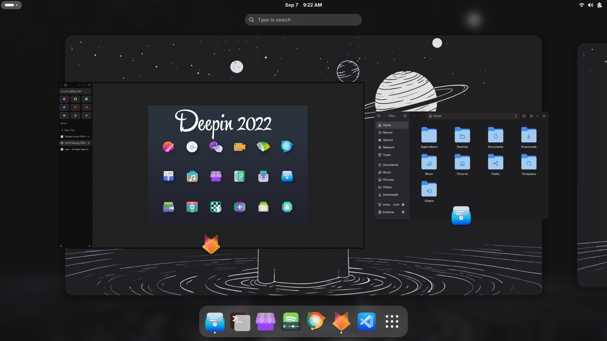

# Deepwaita Icon Theme

 

## Overview

**Deepwaita** is a custom GNOME icon theme that combines the vibrant application icons from the Deepin 2022 theme with the clean system and folder icons of Adwaita. 

> **Note:** This theme is a personal backup and has been tested exclusively on GNOME. It is not officially supported by Deepin or GNOME.

## Features

- **Application Icons:** Utilizes Deepin 2022 icons for a modern and colorful application interface.
- **System Icons:** Falls back to Adwaita for system-related icons such as battery, network, and settings.
- **Folder Icons:** Uses Adwaita's default folder icons for consistency and simplicity.
- **Lightweight:** Designed to be minimal and efficient, ensuring a smooth user experience.

## Credit
### Adwaita
https://www.gnome-look.org/browse?tag=adwaita
### Deepin 2022
https://www.gnome-look.org/p/1678986
